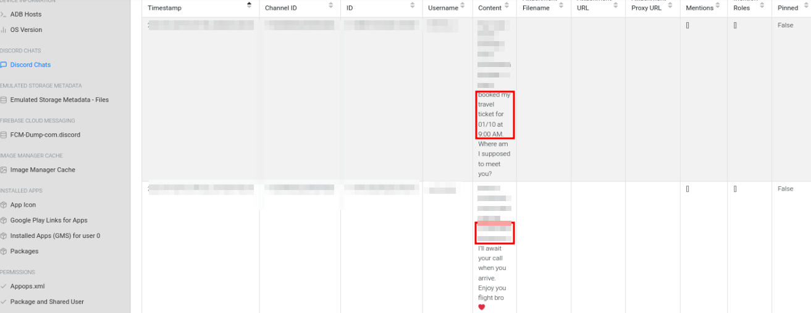

# Mobile Forensics Timeline Reconstruction
*A professional writeup for a mobile DFIR investigation (CyberDefenders - The Crime Lab)*

**Tags:** `#dfir` `#mobile-forensics` `#android` `#osint` `#timeline-analysis` `#cyberdefenders` `#aleapp`

## Case Summary

- **Type:** DFIR (Endpoint Forensics)
- **Source / Platform:** CyberDefenders
- **Scenario:** We're currently in the midst of a murder investigation, and we've obtained the victim's phone as a key piece of evidence. After conducting interviews with witnesses and those in the victim's inner circle, your objective is to meticulously analyze the information we've gathered and diligently trace the evidence to piece together the sequence of events leading up to the incident.
- **Date Completed:** 2025-06-16
- **Objective:** Establish the sequence of events leading up to the murder

---

## Tools Used
- `ALEAPP`, `Yandex Images`
---

## Q1. Based on the accounts of the witnesses and individuals close to the victim, it has become clear that the victim was interested in trading. This has led him to invest all of his money and acquire debt. Can you identify the SHA256 of the trading application the victim primarily used on his phone?

### Methodology

1. First, I generated the ALEAPP report from the given Android evidence by running: `python3 aleapp.py -t fs -i ../temp_extract_dir/data/ -o ../`
2. I opened the generated index.html with Firefox, then browsed through the various menu points.
3. I tried searching for clues under 'Chrome - Search Terms' and 'Chrome - Web History'. I found various searches and sites visited relating to trading, thereby confirming that the victim really was interested in trading. No clue found regarding the question.
3. Under 'Installed Apps', I went through the 'App Icon report' where I noticed the icon of trading application. No other trading apps were present.

*Figure 1: App Icon of trading app from ALEAPP App Icon report*
4. I searched under 'Installed Apps (GMS) for user 0' to find the trading app's Bundle ID. To the right of it, the report table contains the SHA-256 hash of the application.

*Figure 2: SHA256 hash for the trading app from ALEAPP Installed Apps report*
### Interpretation

Since there were no other trading apps present on the device other than the one I found, it is the only candidate for the victim's primarily used trading application.

## Q2. According to the testimony of the victim's best friend, he said, "While we were together, my friend got several calls he avoided. He said he owed the caller a lot of money but couldn't repay now". How much does the victim owe this person?

### Methodology

1. Went through the 'Call logs report' to find many sequential missed or rejected calls from the same caller. Noted the phone number.

*Figure 3: Several missed calls from the previously noted number as seen in ALEAPP Call logs report*
2. It occured to me that people usually follow up with an SMS or through an online messaging app (e.g. FB Messenger) when they can't reach their contacts. So I checked the 'SMS messages report'.
3. I compared the previously noted phone number with the SMS record I saw. It was a match. The SMS body contained a threatening message, which contained the sum of the owed money.

*Figure 4: The threatening message received by the victim as seen in ALEAPP SMS messages report*

### Interpretation

The victim's best friend probably told the truth (provided that they really were together at the time of the calls), because there were indeed missed and rejected calls present in the logs, along with a threatening message received from the same phone number as the calls.

## Q3. What is the name of the person to whom the victim owes money?

### Methodology

1. I went to the 'Contacts report' and searched for the phone number with 'Ctrl + F'. I had to format the previously noted phone number for a successful search.
3. The matching row contained the 'Display Name' of the threatening contact.

*Figure 5: The contact to whom the previously noted phone number belongs as seen in ALEAPP Contacts report*

### Interpretation

The person to whom the victim owes money is under a specific 'Display Name'. Since it is common for people to give phone contacts nicknames instead of real names, it is more likely that the suspect's last name is a nickname. 

## Q4. Based on the statement from the victim's family, they said that on September 20, 2023, he departed from his residence without informing anyone of his destination. Where was the victim located at that moment?

### Methodology

1. Searched through 'Image Manager Cache' to find cached images.
2. On the first page there was a picture with palm trees and a pool so I assumed it was part of a hotel. I took a screenshot and search for the image through Yandex Images. At first I couldn't confirm the location.

*Figure 6: The "hotel pool image" as seen in ALEAPP Image Manager Cache*
3. On the second page, I found a cached icon of 'Booking.com' and what looked like a reviewer on the site.

*Figure 7: Indicators of Booking and some kind of reviewer as seen in ALEAPP Image Manager Cache*
4. I also found a room that looked like a hotel room. Did a reverse image search like previously.

*Figure 8: The "hotel room image" as seen in ALEAPP Image Manager Cache*
5. Upon looking at the results I saw that both reverse image searches contained some common terms. So I searched for those online, and it turned out to be the residence of the victim.

*Figure 9: Reverse Image Search of "hotel pool image" on Yandex Images. Multiple clues hinting at a specific place.*

*Figure 10: Reverse Image Search of "hotel room image" on Yandex Images. Again, multiple clues hinting at a specific place.*

### Interpretation

The victim possibly found his reservation online (Booking) where some of the pictures of the place were cached.

## Q5. The detective continued his investigation by questioning the hotel lobby. She informed him that the victim had reserved the room for 10 days and had a flight scheduled thereafter. The investigator believes that the victim may have stored his ticket information on his phone. Look for where the victim intended to travel.

### Methodology

1. Under 'Discord Chats report' there was a short messaging between a friend of the victim and the victim.
2. The chat mentioned the victim who had booked a travel ticket, and where the victim and his friend were supposed to meet after the victim's arrival.

*Figure 11: Short chat between the victim and his friend under aliases as seen in ALEAPP Discord Chats report*
3. Did a Google Search for the place mentioned in the Discord chat and the results came back with the location where the victim intended to travel.

### Interpretation

The timestamps of the Discord messages found clearly show the exact same date when the victim left his residence. The evidence shows that the victim booked a travel ticket for 2023-10-01 to ultimately travel to the location of the meeting place, so its strange for him to disappear for 10 days before the flight takes place.

## Q6. After examining the victim's Discord conversations, we discovered he had arranged to meet a friend at a specific location. Can you determine where this meeting was supposed to occur?

See Q5 (Accidentally answered this question in advance)

---

## Artifacts Collected

- [Trading searches](./assets/Q1_0.png)
- [Trading app icon](./assets/Q1_1.png)
- [Traing app hash](./assets/Q1_2.png)
- [Missed calls](./assets/Q2_0.png)
- [Threatening message](./assets/Q2_1.png)
- [Suspect contact](./assets/Q3_0.png)
- [The hotel pool](./assets/Q4_0.png)
- [Booking indicators](./assets/Q4_1.png)
- [The hotel room](./assets/Q4_2.png)
- [The hotel pool Yandex search](./assets/Q4_3.png)
- [The hotel room Yandex search](./assets/Q4_4.png)
- [Discord messaging](./assets/Q56.png)

---

## Final Outcome

The reconstructed sequence of events is as follows:
1. In the past, the victim was interested in trading, so he invested all his money but this has led him to acquire a debt to the suspect.
2. On the evening of 2023-09-20 the victim was with his best friend, and while he was with him, the victim received numerous missed calls and a threatening message from the suspect, demanding his owed money.
3. The victim stayed at a specific hotel at this time, but on the very same day of 2023-09-20 after he received the threats, he booked a flight to a specific place. The flight was scheduled on 2023-10-01, and the victim told this to his friend.
4. His friend informed the victim on 2023-09-20, that after his arrival, they should meet at the specific meeting place they discussed.
5. The murder happened sometime after these events but before the friends could meet.

The analysis of the evidence implies the suspect had an incentive for the murder and is possibly involved in it.

---

## Lessons Learned

- `ALEAPP` is very convinient to use to quickly search through artifacts and reports that are commonly sought after. It can be extended with artifact plugins as well.
- In hindsight, when answering Q4:
  - I should have been more carefully examining the first "pool photo" results, because that contained the solution already.
  - I should have looked at the 'Recent Tasks, Snapshots & Images report' because it contained a screenshot of Google Maps made on the day of the victim's departure from his residence. It contained the solution as well. However, my solution cannot confirm that he really did depart at September 20, 2023, while this undoubtedly can.
- During the investigation of Q4 I probably would have been better off to think in simpler terms and read the question for hints, as later reading the hints made me realize that there was an actual ticket on the file system somewhere which I could have easily find using a regular file browser instead.
- Next time the discovered aliases and usernames could go under the Artifacts section, as they could aid further investigation through e.g. OSINT.
---

## References & Resources
- [CyberDefenders - The Crime Lab](https://cyberdefenders.org/blueteam-ctf-challenges/the-crime/)
- [Google Search](https://www.google.com)
- [Yandex Images](https://yandex.com/images/)
- [ALEAPP GitHub](https://github.com/abrignoni/ALEAPP)
