# Supply Chain Attack Examination
*A professional writeup for a supply chain attack investigation (CyberDefenders - 3CX Supply Chain Lab)*

**Tags:** `#threat-intel` `#cyberdefenders` `#virustotal` `#supply-chain-attack` `#malware` `#windows`

## Case Summary

- **Type:** Threat Intel
- **Source / Platform:** CyberDefenders
- **Scenario:** A large multinational corporation heavily relies on the 3CX software for phone communication, making it a critical component of their business operations. After a recent update to the 3CX Desktop App, antivirus alerts flag sporadic instances of the software being wiped from some workstations while others remain unaffected. Dismissing this as a false positive, the IT team overlooks the alerts, only to notice degraded performance and strange network traffic to unknown servers. Employees report issues with the 3CX app, and the IT security team identifies unusual communication patterns linked to recent software updates. As the threat intelligence analyst, it's your responsibility to examine this possible supply chain attack. Your objectives are to uncover how the attackers compromised the 3CX app, identify the potential threat actor involved, and assess the overall extent of the incident. 
- **Date Completed:** 2025-06-19
- **Objective:** Uncover how the attackers compromised the 3CX app, identify the potential threat actor involved, and assess the overall extent of the incident.

---

## Tools Used
- `VirusTotal`
---

## Q1. Understanding the scope of the attack and identifying which versions exhibit malicious behavior is crucial for making informed decisions if these compromised versions are present in the organization. How many versions of 3CX running on Windows have been flagged as malware?

### Methodology
1. Uploaded the provided .msi file to VirusTotal
2. Found nothing of interest, so after a while I used a hint to read reports
3. Read [Cyble report](https://cyble.com/blog/a-comprehensive-analysis-of-the-3cx-attack/)
4. Checked other reports too (e.g. [3CX blog](https://www.3cx.com/blog/news/desktopapp-security-alert/)) to confirm the number of affected versions
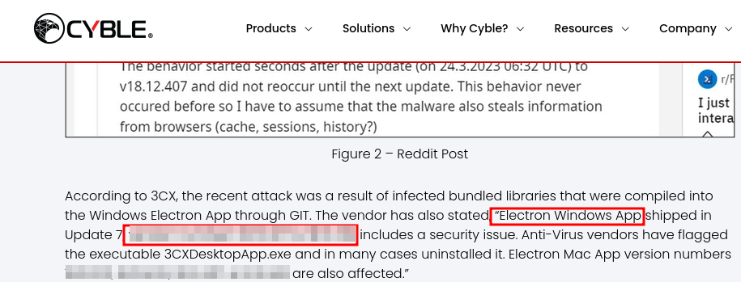

*Figure 1: Windows app versions affected as seen in the Cyble report*

### Interpretation

According to the checked reports, the Electron based 3CX Desktop App on Windows was compiled with infected libraries, which resulted in a certain number of versions getting affected by the attack. On MacOS there are more versions that were affected.

## Q2. Determining the age of the malware can help assess the extent of the compromise and track the evolution of malware families and variants. What's the UTC creation time of the .msi malware?

### Methodology

1. Used the VirusTotal upload search made previously to find the creation time under 'Details' tab.
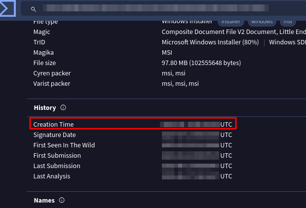

*Figure 2: The creation time of the malware according to VirusTotal*

## Q3. Executable files (.exe) are frequently used as primary or secondary malware payloads, while dynamic link libraries (.dll) often load malicious code or enhance malware functionality. Analyzing files deposited by the Microsoft Software Installer (.msi) is crucial for identifying malicious files and investigating their full potential. Which malicious DLLs were dropped by the .msi file?

### Methodology

1. 3. Upon reading the [Cyble report](https://cyble.com/blog/a-comprehensive-analysis-of-the-3cx-attack/) it clearly states the names of the two malicious files dropped
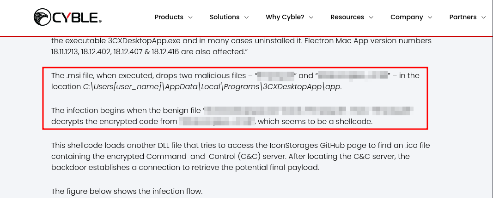

*Figure 3: Malicious DLLs dropped by the malware as seen in the Cyble report*

### Interpretation

The .msi installer installs 3CXDesktopApp.exe, which would be benign itself, but installer also drops the two malicious DLLs under "C:\Users\<username>\AppData\Local\Programs\3CXDesktopApp\app". Upon launching the 3CXDesktopApp.exe it loads and executes one of the malicious DLLs, which reads and decrypts the shellcode from the other DLL. This shellcode then gets executed, which results in the embedded DLL getting loaded. That final DLL tries to establish a connection to a GitHub repository that contains an .ico file (icon), which contains an encrypted C&C server URL. It then proceeds to decrypt it and then download additional payload from the C&C server.

## Q4. Recognizing the persistence techniques used in this incident is essential for current mitigation strategies and future defense improvements. What is the MITRE Technique ID employed by the .msi files to load the malicious DLL?

### Methodology

1. On the VirusTotal analysis site of the uploaded file I looked up the 'Behavior' tab.
2. The question hints at looking at persistence techniques, so I looked those up on this page.
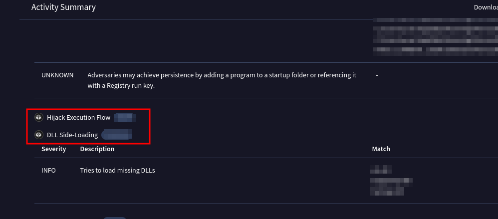

*Figure 4: The MITRE Hijack Execution Flow Technique as seen on VirusTotal*

### Interpretation

The malware hijacks the way the OS runs the program normally, by loading the malicious DLLs into memory and running them, thereby hijacking the normal execution flow.

## Q5. Recognizing the malware type (threat category) is essential to your investigation, as it can offer valuable insight into the possible malicious actions you'll be examining. What is the threat category of the two malicious DLLs?

### Methodology

1. On VirusTotal, still under the 'Behavior' tab under 'Files Dropped' we can see the two malicious DLLs, and clicking on them reveals their SHA-256 hashes.
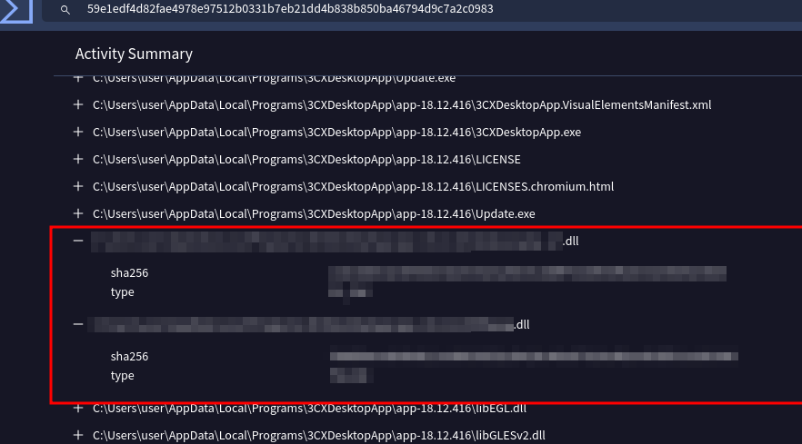

* Figure 5: The malicious DLL hashes seen on VirusTotal*

2. Searching for the found hashes on VirusTotal yiedls a specific thread category in both cases.
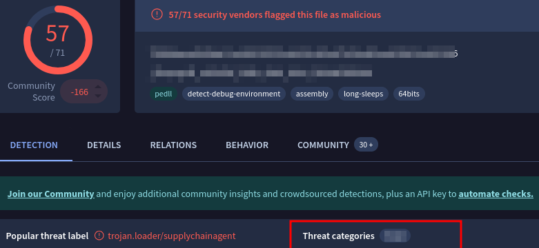

* Figure 6: The first malicious DLL's threat category as seen on VirusTotal page *

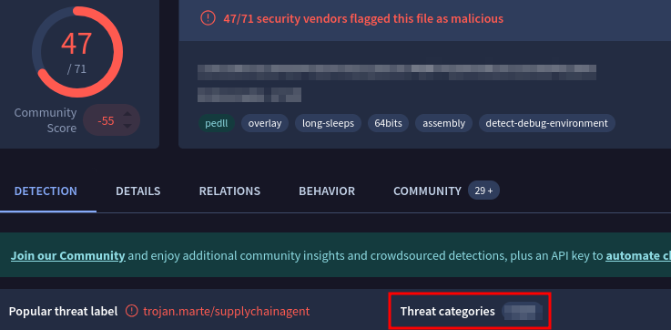

* Figure 7: The second malicious DLL's threat category as seen on VirusTotal page *

### Interpretation

The two DLLs are of a specific category because they act as perfectly valid DLLs, but in reality they perform malicious actions such as downloading and executing payloads.

## Q6. As a threat intelligence analyst conducting dynamic analysis, it's vital to understand how malware can evade detection in virtualized environments or analysis systems. This knowledge will help you effectively mitigate or address these evasive tactics. What is the MITRE ID for the virtualization/sandbox evasion techniques used by the two malicious DLLs?

### Methodology

1. As before, the 'Behavior' tab on both DLLs VirusTotal pages has a "MITRE ATT&CK Tactics and Techniques" section, which contains the 'Defense Evasion' Tactic menu. Under this there is a technique called "Virtualization/Sandbox Evasion" to which the question is aiming at.
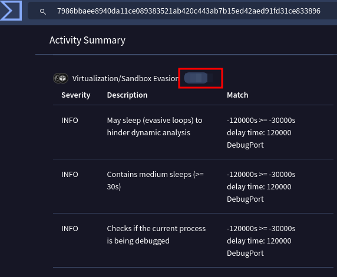

* Figure 8: The Virtualization/Sandbox Evasion technique of the malicious DLLs as seen on VirusTotal*
### Interpretation

Both the VirusTotal pages and the Cyble report confirm that the malicious DLLs use extended amounts of sleeping during their execution to try to evade detection. The Cyble report specifically mentions that the final embedded DLL file in the shellcode waits (sleeps) for 7 days, before trying to make contact with the GitHub repository mentioned before.

## Q7. When conducting malware analysis and reverse engineering, understanding anti-analysis techniques is vital to avoid wasting time. Which hypervisor is targeted by the anti-analysis techniques in the ffmpeg.dll file?

### Methodology

1. On the 'Behavior' tab of the ffmpeg.dll VirusTotal page, I searched for "Anti-Analysis" string.
2. There was a match under the 'Capabilities' section, and there it clearly states the answer.

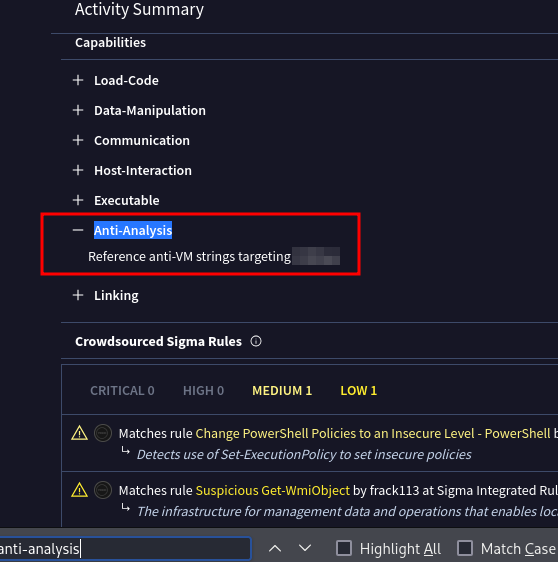

* Figure 9: The Anti-Analysis section of the ffmpeg.dll as seen on VirusTotal*
### Interpretation

The ffmpeg.dll contains anti-VM strings in its code, which is targeting a very commonly used hypervisor. In contrast, according to VirusTotal, one of the other malicious DLLs check for software breakpoints and uses code obfuscation.

## Q8. Identifying the cryptographic method used in malware is crucial for understanding the techniques employed to bypass defense mechanisms and execute its functions fully. What encryption algorithm is used by the ffmpeg.dll file?

### Methodology

1. I remembered what I read in the [Cyble report](https://cyble.com/blog/a-comprehensive-analysis-of-the-3cx-attack/) of the attack, which describes the decryption process.
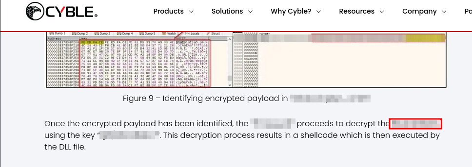
* Figure 10: The encryption method mentioned during the description of the decryption process as seen in the Cyble report*

### Interpretation

As mentioned before, one of the malicious DLLs has an encrypted payload embedded in it, which the "ffmpeg.dll" identifies and then decrypts.

## Q9. As an analyst, you've recognized some TTPs involved in the incident, but identifying the APT group responsible will help you search for their usual TTPs and uncover other potential malicious activities. Which group is responsible for this attack?

### Methodology
1. The [Cyble report](https://cyble.com/blog/a-comprehensive-analysis-of-the-3cx-attack/) mentions that the attack was attributed to a North Korean APT group.
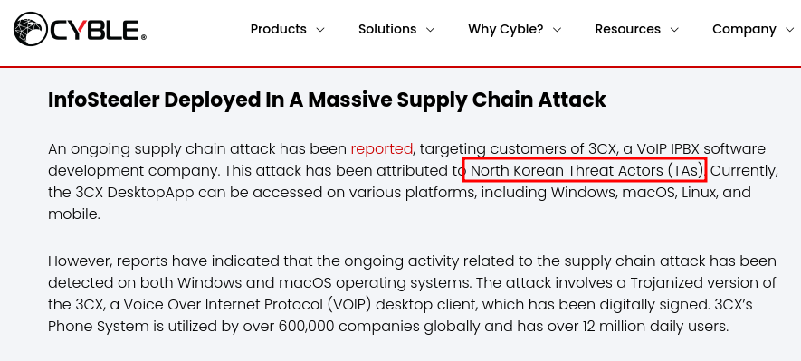

* Figure 11: North Korean APT group mentioned as seen on Cyble*
2. Did a Google search for "3CX supply chain attack North Korean APT group"
3. Found an [analysis](https://www.picussecurity.com/resource/blog/smoothoperator-analysis-of-3cxdesktopapp-supply-chain-attack) on picussecurity.com, which names the attributed North Korean APT group.
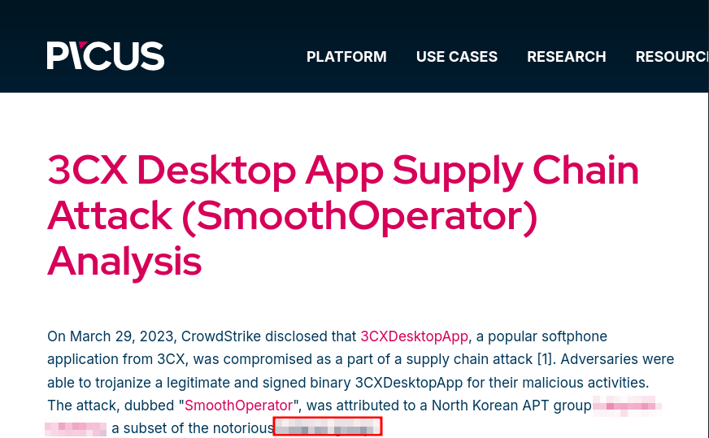

* Figure 12: North Korean APT group attributed to attack as seen on picussecurity.com*

### Interpretation

The attack became known as "SmoothOperator", and was attributed to an infamous North Korean APT group, specifically, to the subset of this group which is called "Labyrinth Chollima". Further research that analyzes the TTPs employed by the APT group can aid proactive defensive measures against them.

---

## Final Outcome

The attackers were members of Labyrinth Chollima, a subset of a famous North Korean APT group. They managed to compromise the 3CX app by infecting two bundled libraries which were compiled into the Electron based Windows 3CX Desktop app. Because of this, the app silently became a malware disguised as a completely valid and officially signed software through just one software update. Users then began to use the application, which eventually led to degraded performance and strange network traffic observed by the IT team. Since every computer that received the 3CX software update became infected, the extent of the incident is probably much greater than just the workstations of the company, as other companies use 3CX as well.

---

## Lessons Learned

- Malware writers often employ anti-analysis measures such as code obfuscation or contain anti-VM strings to combat analysis and reverse engineering efforts.
- It's worth to search on Google for reports made by cybersecurity professionals, as others may have already encountered the attack we are facing.
- Think outside the suggested tools to use, as they may not contain any answer whatsoever and you will waste a lot of time if you don't use others. (e.g. Google Search)
- I've learned how a supply chain attack really looks in practice, which is very valuable after hearing so much about it.

---

## References & Resources
- [Cyble report](https://cyble.com/blog/a-comprehensive-analysis-of-the-3cx-attack/)
- [3CX blog](https://www.3cx.com/blog/news/desktopapp-security-alert/)
- [Picus analysis](https://www.picussecurity.com/resource/blog/smoothoperator-analysis-of-3cxdesktopapp-supply-chain-attack)
- [Mitre ATT&CK Framework - Hijack Execution Flow](https://attack.mitre.org/techniques/T1574/)
- [CyberDefenders - 3CX Supply Chain](https://cyberdefenders.org/blueteam-ctf-challenges/3cx-supply-chain/)
- [Google Search](https://www.google.com)
