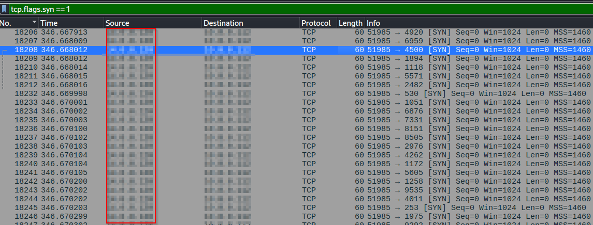
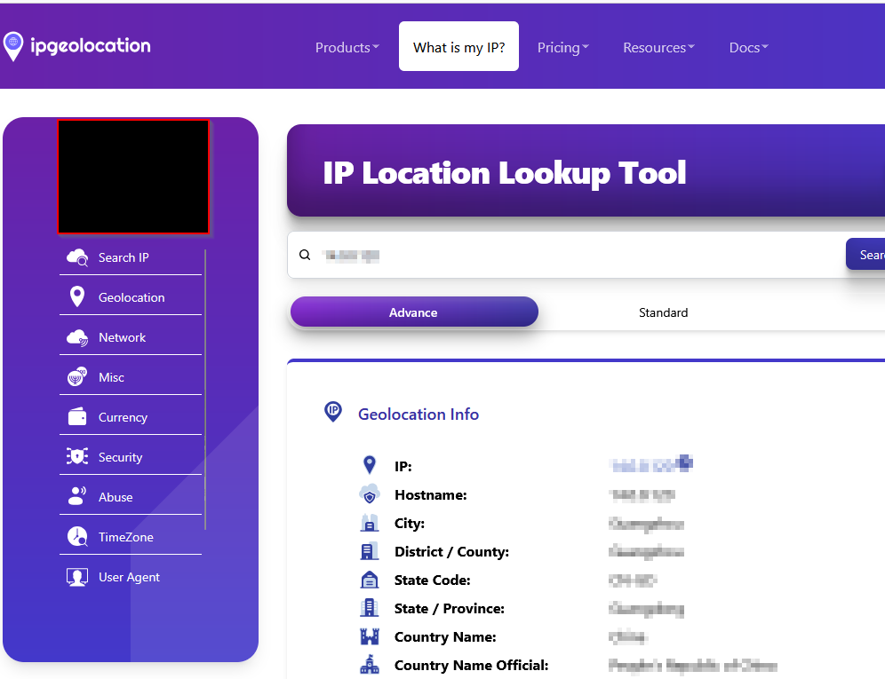
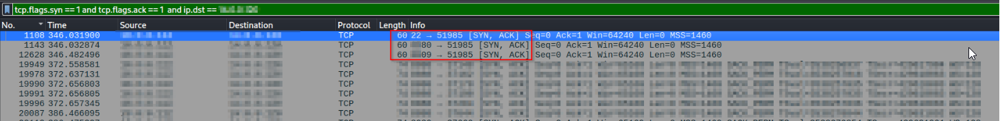
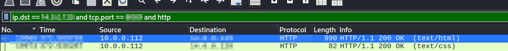
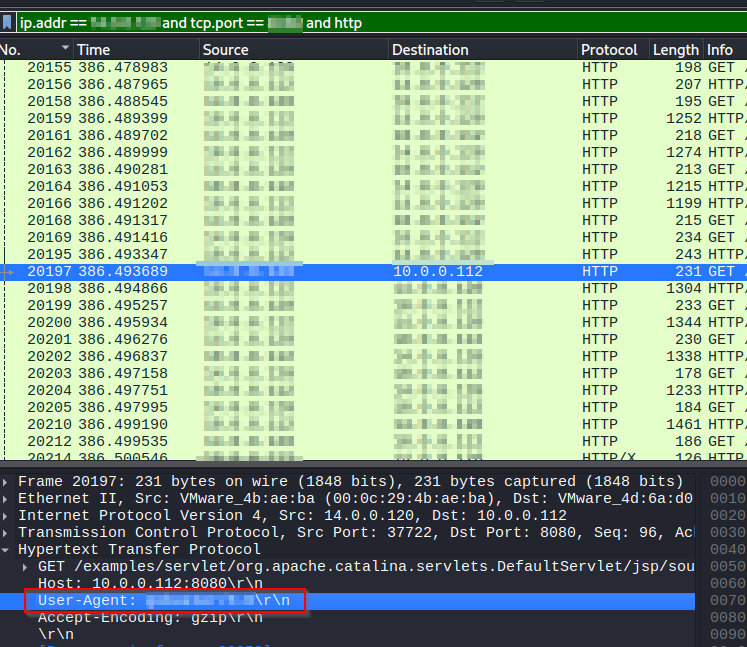
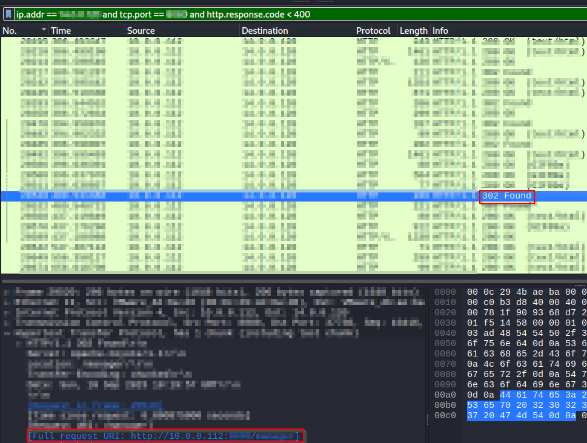
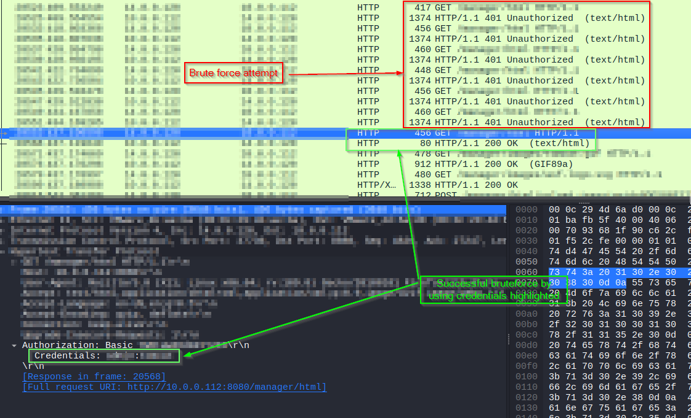
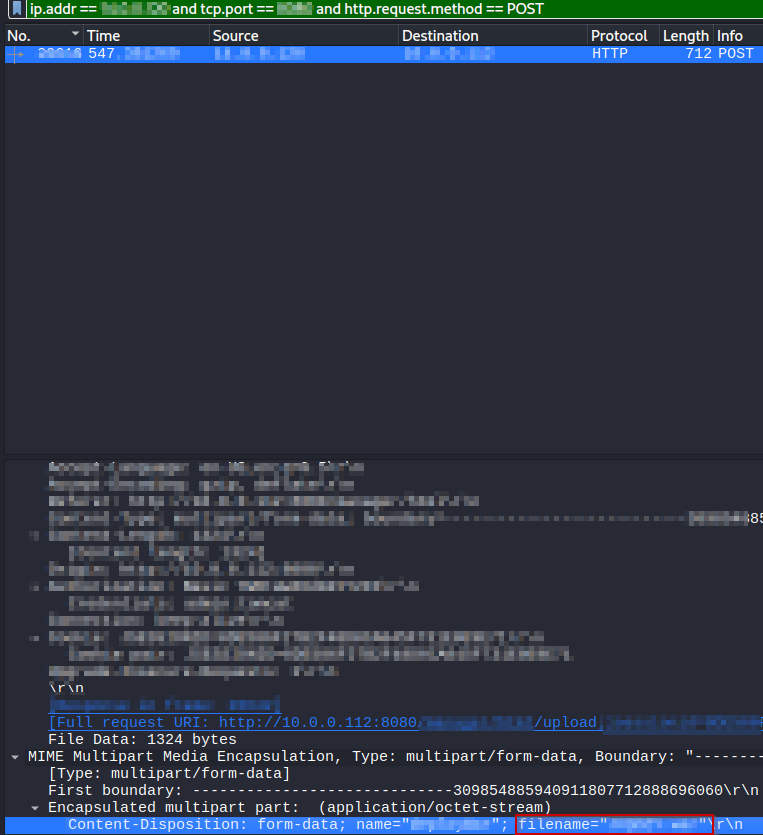
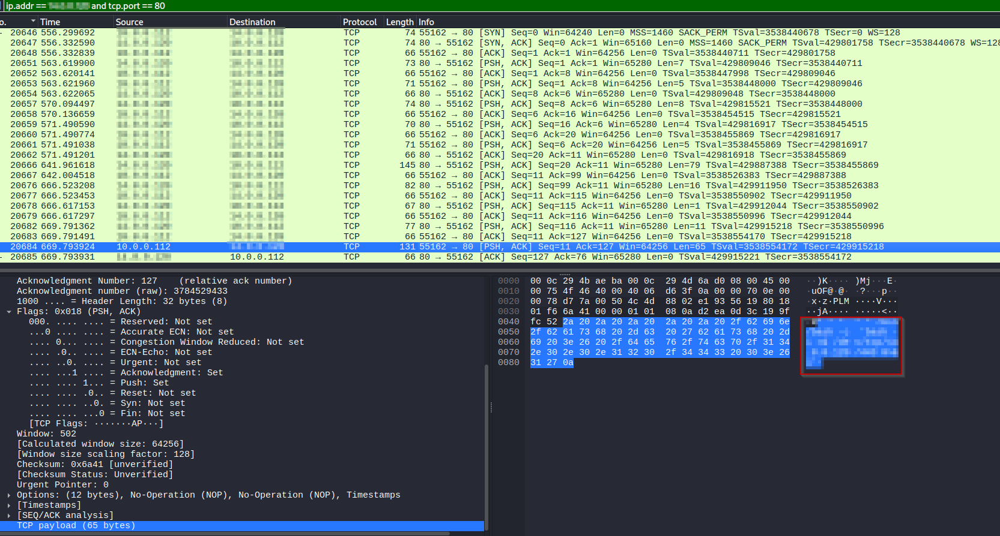

# Network Forensics Of a Compromised Web Server
*A professional writeup for a network forensics lab (Cyberdefenders - Tomcat Takeover)*

**Tags:** `#DFIR` `#NetworkForensics` `#Wireshark`

## Case Summary

- **Type:** Network Forensics
- **Source / Platform:** Cyberdefenders
- **Scenario:** The SOC team has identified suspicious activity on a web server within the company's intranet. To better understand the situation, they have captured network traffic for analysis. The PCAP file may contain evidence of malicious activities that led to the compromise of the Apache Tomcat web server. Your task is to analyze the PCAP file to understand the scope of the attack.
- **Date Completed:** 2025-07-12
- **Objective:** Analyze the PCAP file to understand the scope of the attack.

---

## Tools Used
- `Wireshark`, `ipgeolocation.io`
---

## Q1. Given the suspicious activity detected on the web server, the PCAP file reveals a series of requests across various ports, indicating potential scanning behavior. Can you identify the source IP address responsible for initiating these requests on our server?

### Methodology

1. I figured that one way adversaries commonly do a port scan is by using `nmap`, and specifically using stealth scan, otherwise known as TCP SYN scan.
2. So I did a quick google search for the Wireshark filter to check the SYN flag, applied it and scrolled to see massive amounts of SYN traffic sent to various different ports. The source IP is the attacker.
   
   *Figure 1: Adversary performing port scanning as seen in Wireshark*

## Q2. Based on the identified IP address associated with the attacker, can you identify the country from which the attacker's activities originated?

### Methodology

1.  Used `ipgeolocation.io` to search for the previously found IP.
   
   *Figure 2: The geolocation information of the identified IP obtained from ipgeolocation.io*

## Q3. From the PCAP file, multiple open ports were detected as a result of the attacker's active scan. Which of these ports provides access to the web server admin panel?

### Methodology

1. If a port replies for a SYN scan, then it must do so with SYN-ACK as per the TCP handshake. So I applied two additional filters to include the ack flag, and for the reply to have the destination IP of the attacker.
   
   *Figure 3: The detected open ports as seen in Wireshark*
2. The results indicate that 3 ports replied (note the port number which is the same port the SYN scan originated from), one of which is SSH.
3. Upon looking at the other two ports, only one of them returns traffic with the http filter enabled
   
   *Figure 4: The search for the web server admin panel in Wireshark*
4. Just to be sure I exported the HTTP object related to the request and I found the default Tomcat page.

## Q4. Following the discovery of open ports on our server, it appears that the attacker attempted to enumerate and uncover directories and files on our web server. Which tools can you identify from the analysis that assisted the attacker in this enumeration process?

### Methodology

1. Changed the filter to include all http traffic coming from or to the attacker IP.
2. Purposefully looked at one of the GET requests to check the User-Agent. It revealed the use of a very commonly used enumeration tool.
   

   *Figure 5: The enumeration tool that was used by the attacker infered from the request's User-Agent.*

## Q5. After the effort to enumerate directories on our web server, the attacker made numerous requests to identify administrative interfaces. Which specific directory related to the admin panel did the attacker uncover?

### Methodology

1. Did a Google Images search to see how exactly a Tomcat admin page should look with full css. Seen a different page then the one I exported, but the exported html contained a link to what looked liked that page.
2. So I applied a new filter in Wireshark to search for replies from the web server which had a HTTP response code less than 400 i.e. indicating a match for the attacker.
   
   *Figure 6: Further filtering the HTTP traffic to look for successful replies from the web server.* 
3. After I found that specific directory I looked at earlier, I also saw numerous subsequent successful matches to files under that directory, one of which is a very important GUI interface as I inferred from the [Tomcat documentation](https://tomcat.apache.org/tomcat-7.0-doc).

## Q6. After accessing the admin panel, the attacker tried to brute-force the login credentials. Can you determine the correct username and password that the attacker successfully used for login?

### Methodology

1. Searched through HTTP traffic after attacker has found the specific directory
2. The html page under that directory is accessible only after login, which the attacker tried to brute-force numerous times by using HTTP basic access authentication. Each time they failed, the response was HTTP response code 401: Unauthorized.
3. However, they managed to succeed at the end because the final reply was HTTP 200 OK. The credentials in the Authorization header of the request that belongs to the reply contain the correct username and password.
   
   *Figure 7: The brute-force attempt and the successful login seen during PCAP analysis*

## Q7. Once inside the admin panel, the attacker attempted to upload a file with the intent of establishing a reverse shell. Can you identify the name of this malicious file from the captured data?

### Methodology

1. Uploads are usually done with POST requests, so I applied the Wireshark filter to only include that type of HTTP request.
2. I searched through the MIME information, where I found the answer.
   

   *Figure 8: The captured upload and the inspection of MIME information*

## Q8. After successfully establishing a reverse shell on our server, the attacker aimed to ensure persistence on the compromised machine. From the analysis, can you determine the specific command they are scheduled to run to maintain their presence?

### Methodology

1. Looked at the TCP traffic after the attacked established the reverse shell, which indicated that the attacker has opened their reverse shell on port 80.
2. Filtered to see only the reverse shell communication and went through the TCP payloads to see the decoded commands sent. The attacker can be seen rewriting the whole crontab with their own, which they previously wrote to a temporary file. Then they list the currently set cron jobs to verify that they have successfully applied persistence.
   
   *Figure 9: The command that can be seen as the result of listing the actually live cron jobs in the user's crontab.*

Note: By the way the command itself is spawning a reverse shell, because it essentially means "Start an interactive bash session but redirect *stdout* and *stderr* to a freshly made TCP connection to the attacker IP at port 443 while redirecting the input to the already redirected standard output.". The crontab persistence is there to make sure that each minute this tries to run no matter what, in case the attacker loses connection and wants to set foot again.

---

## Final Outcome

An outside attacker managed to compromise an Apache Tomcat web server. They first ran a TCP SYN port scan to determine active services. 3 ports replied and one of them ran the Tomcat web server. The attacker then proceeded to enumerate resources found on the web server, which led them to an administrative page, where they had to brute-force credentials to log in and upload their malicious file, which enabled them to spawn a reverse shell. From there the attacker made their presence persistent by modifying the crontab contents to always try to spawn a reverse shell every minute.

---

## Lessons Learned

- Found a new tool for finding the geolocation of IP addresses: `ipgeolocation.io`
- crontab -i \<filename\> can be (incorrectly) used to completely overwrite the contents of the previous crontab file with the contents found in \<filename\> 
- How stealth scan and <\very specific enumeration tool\> traffic looks like from a blue team perspective. (Already used these on the red team side previously on training platforms)

---

## References & Resources
- [CyberDefenders - Tomcat Takeover Lab](https://cyberdefenders.org/blueteam-ctf-challenges/tomcat-takeover/)
- [ipgeolocation.io](https://ipgeolocation.io)
- [Apache Tomcat 7.0 documentation](https://tomcat.apache.org/tomcat-7.0-doc)
- [Wikipedia - HTTP basic access authentication](https://en.wikipedia.org/wiki/Basic_access_authentication)
