# PDF Malware Analysis
*A professional writeup for a malware analysis case (CyberDefenders - GetPDF Lab)*

**Tags:** `#malware-analysis` `#pdf-malware` `pdf-analysis` `javascript` `python`

## Case Summary

- **Type:** Malware Analysis
- **Source / Platform:** CyberDefenders
- **Scenario:** PDF format is the de-facto standard in exchanging documents online. Such popularity, however, has also attracted cyber criminals in spreading malware to unsuspecting users. The ability to generate malicious pdf files to distribute malware is a functionality that has been built into many exploit kits. As users are less cautious about opening PDF files, the malicious PDF file has become quite a successful attack vector.
  The network traffic is captured in lala.pcap contains network traffic related to a typical malicious PDF file attack, in which an unsuspecting user opens a compromised web page, which redirects the user’s web browser to a URL of a malicious PDF file. As the PDF plug-in of the browser opens the PDF, the unpatched version of Adobe Acrobat Reader is exploited and, as a result, downloads and silently installs malware on the user’s machine.
- **Date Completed:** 2025-07-13
- **Objective:** As a soc analyst, analyze the PDF and answer the questions.

---

## Tools Used
- `Wireshark`,`de4js`, `pdf-parser`, `peepdf`, `pdfid`, `scdbg`, `md5sum`, `firefox-developer-tools`
---

## Q1. How many URL path(s) are involved in this incident?

### Methodology
1. First I opened the provided PCAP file with Wireshark and started to look for DNS queries. There were 3 domains queried but only 1 out of those were resolved to an IP.
2. Then I looked at the HTTP traffic between the source and the previously identified IP.
3. At first I thought I should only count the paths that were at least present on the site, otherwise how can they be involved? So I counted how many paths returned an HTTP response code that was less than 400. That gave me a wrong answer. So I counted all of the unique requests and that turned out to be the correct one.
   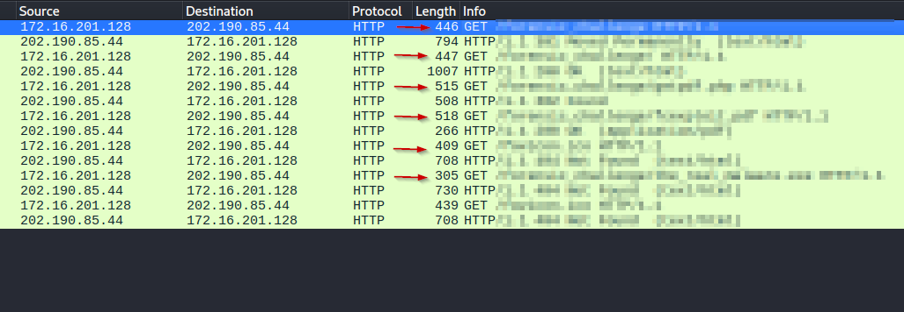
   *Figure 1: The URL paths that were requested from the web server as seen in Wireshark.*

## Q2. What is the URL which contains the JS code?

### Methodology
1. Since there is no other HTTP traffic in the PCAP file, I exported the HTTP objects and saved to disk the pdf and the html that belongs to the only 200 OK text/html response.
2. I opened the html in a text editor and saw obfuscated JS code. So I went back to Wireshark and searched for the corresponding HTTP response. The full request URI can be read from there.
   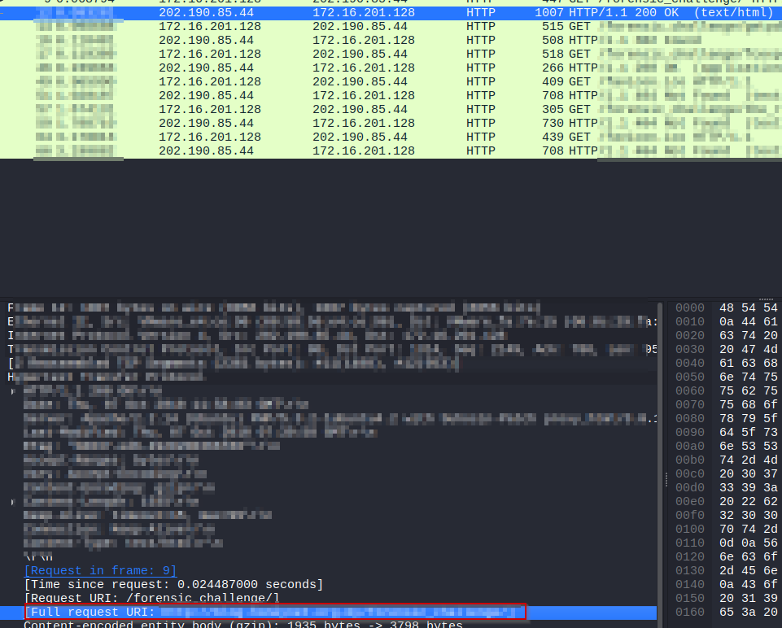
   *Figure 2: The URL that contains the obfuscated JS code. *

## Q3. What is the URL hidden in the JS code?

### Methodology
1. I copied the obfuscated JS code and then pasted it to [de4js](https://lelinhtinh.github.io/de4js/) , a JavaScript deobfuscator tool, which at least made the code formatted for easier reading.
2. Copied this code and fired up the JS Console in Firefox Dev Tools, where I started to analyse it. I carefully pasted in just one piece of code at a time, making sure that I __never paste and run code that calls obfuscated, potentially malicious functions.__
3. I started to `console.log` variables where `replace` was called, so I can see what the intended values were. Then I worked my way to the end, were I figured out the obfuscated function calls, and essentially defanged the code by making the final call just a `console.log`.     
   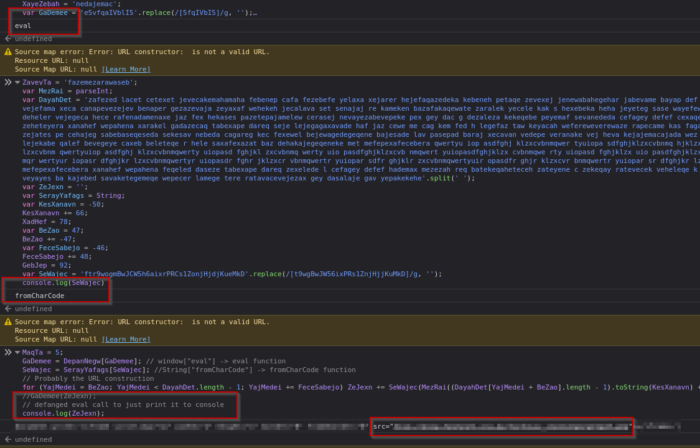
   *Figure 3: Analysing the formatted but obfuscated JS code in Firefox Developer Tools' JS Console*

## Q4. What is the MD5 hash of the PDF file contained in the packet?

### Methodology
1. Since I already saved the PDF earlier from the HTTP object exports, I just ran `md5sum` on it.

## Q5. How many object(s) are contained inside the PDF file?

### Methodology
1. I used `pdf-parser` to try to find the number of objects. I thought that gave me the right answer, but it turned there is one more object in the PDF file, which  `pdfid` automatically took into account.
   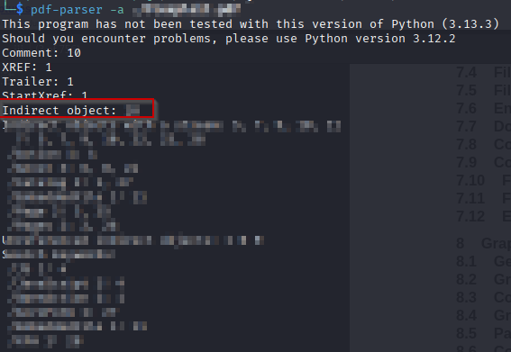
   *Figure 4: The output of `pdf-parser -a` which displays statistics about the PDF *
   
   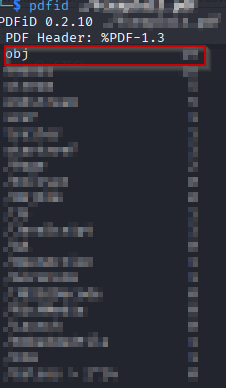
   *Figure 5: The output of `pdfid` which actually found all the objects in the PDF*
## Q6. How many filtering schemes are used for the object streams?

### Methodology
1. Used the command `pdf-parser -O -v <pdf_file>` to output information on objects. Trailer information of object streams shows filtering schemes that match for all object streams in the PDF.
   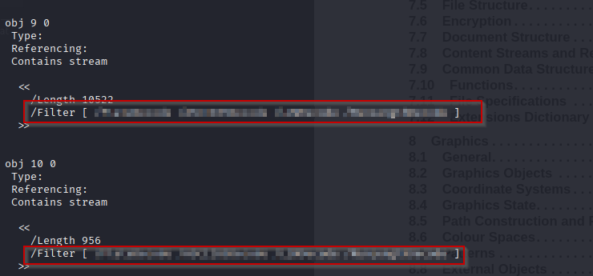
   *Figure 6: Filtering schemes as seen in the output of `pdf-parser -O -v <pdf_file>`*

## Q7. What is the number of the 'object stream' that might contain malicious JS code?

### Methodology
1. Still in the same output of the previous command one can see that object 4 is of type "/Action" which wants to runs JavaScript from a referenced object. That referenced object's number is the answer.
   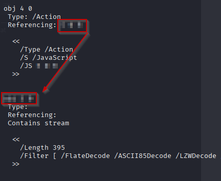
   *Figure 7: The Action object that references another object which might contain malicious JavaScript code*

## Q8. Analyzing the PDF file. What 'object-streams' contain the JS code responsible for executing the shellcodes? The JS code is divided into two streams. Format: two numbers separated with ','. Put the numbers in ascending order

### Methodology
1. Since `pdf-parser` failed to properly uncompress the object streams, I used `peepdf -if <pdf_file>` command to forcefully try to analyse the pdf and open an interactive session with the program. Then I inspected the object stream that contained JS from the previous question.
2. Used [de4js](https://lelinhtinh.github.io/de4js/) again to try to deobfuscate it. From there I analysed the code as before, and found that its again using the same '`eval`' + '`fromCharCode construction`' tactics. However, I had a bit of trouble interpreting the `$S = this.info.title` part correctly. So I had to look up a bunch of information and it turned out that this is referencing the "Info" dictionary of the PDF trailer, where metadata could reside. Specifically, it wants to get the "/Title" metadata. Navigating to the info object within the interactive `peepdf` session revealed the object number that contained this "/Title" metadata.
   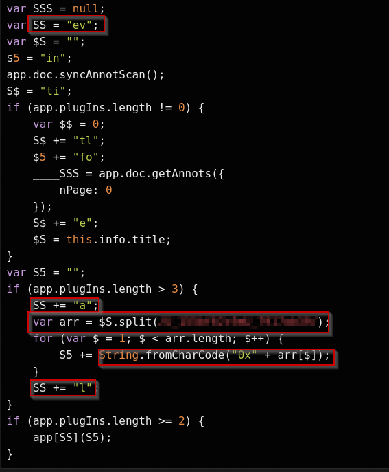
   *Figure 8: The formatted JS code from the previous question with tactics highlighted *
3. Upon reading the decoded contents of the object stream it looked like it contained the argument of the `split` function call as a delimiter, so I knew that this must be what I'm looking for. I copied the decoded contents and called the split function on it in a JS console. Then I ran the string building part and printed out the results to the screen.
   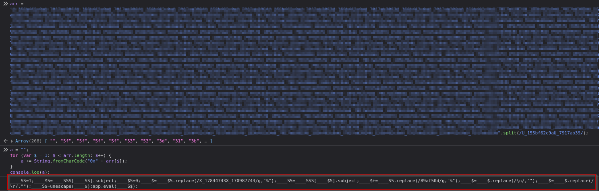
   *Figure 9: The hidden JS code constructed from the object stream that belongs to the "/Title" metadata.*
4. Since in the original JS code the next instruction is to actually `eval` this string, I replaced and reformatted the code segment with the found JS code.
5. Code analysis: This new code is first looking for the second annotation in the array of annotations found previously and wants to get the "/Subj" key of it. It then proceeds to replace certain parts of it with the "%" character. Then does the same thing with the first annotation in the array, and concatenates the two. After deleting newlines and carriage returns, it then replaces hexadecimal escape sequences with the characters they represent. 
   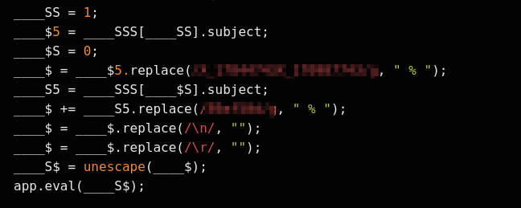
   *Figure 10: The formatted code from the object stream that belongs to the "/Title" metadata.*
6. Upon inspecting the annotation references in the output of `pdf-parser`, I found the references for the two "/Subj" keys used, and again copy-pasted the contents of the object streams to deobfuscate the next `eval` call.
   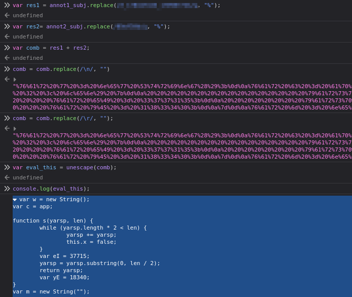
   *Figure 11: Replicating and safely evaluating the code that leads up to the next `eval` call*
7. Since this latest JS code was constructed from two separate object streams and the deobfuscated string heavily implies it contains the actual shellcode, we now have the answer if we consider the object numbers.

## Q9. The JS code responsible for executing the exploit contains shellcodes that drop malicious executable files. What is the full path of malicious executable files after being dropped by the malware on the victim machine?

### Methodology
1. Further static analysis of the full JS shellcode extracted was futile in determining the path. The unescaped shellcodes looked like Chinese characters. I admit this was the point where I realized I needed some help, so I looked up the official writeup to see just what was I supposed to do here.
2. So after peeking into the guide, I had to switch to my FLARE-VM which had `scdbg` preinstalled. There, I copied the part of the Python script from the official writeup where they essentially mimic the JS `unescape` function, chose one of the encoded payload strings, hardcoded it in the script, then I wrote the decoded contents to disk as binary. Next I used the command `scdbg -f out.bin` to analyse the shellcode for Kernel API calls. It found a call to `URLDownloadToFileA` which contained the full path for the dropped malicious executable.
   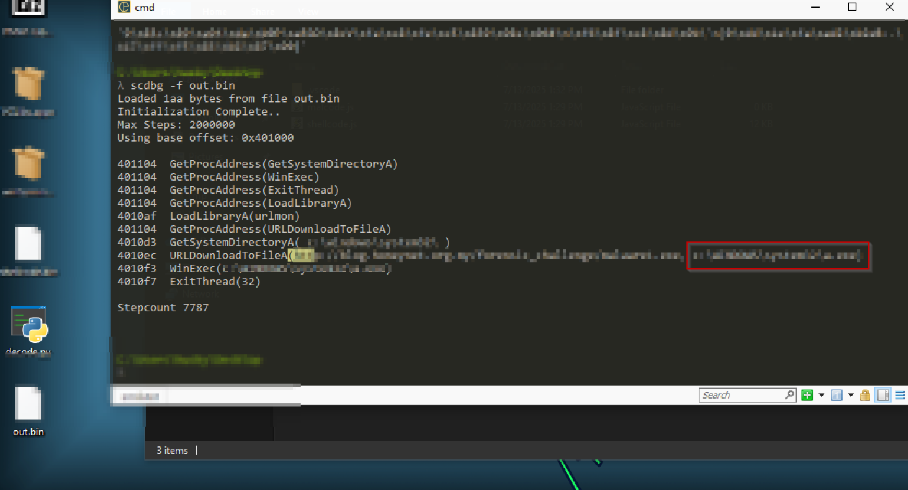
   *Figure 12: The output of `scdbg -f out.bin` after I decoded one of the shellcodes on FLARE-VM*

## Q10. The PDF file contains another exploit related to CVE-2010-0188. What is the URL of the malicious executable that the shellcode associated with this exploit drop?

### Methodology
1. After some thinking I realized that the PCAP file analysed earlier contained an HTTP GET request to get an executable which was not found during the whole analysis up until this point. So I went back to Wireshark and checked the Full request URI field. Tried it, and indeed that was the right answer.

## Q11. How many CVEs are included in the PDF file?

### Methodology
1. Went back to analyse the full JS shellcode. I noticed that based on the Adobe software version numbers, different function calls take place. And they had similar structure: construct and prepare something (the exploit as I have found out), and then call an Adobe specific function using the prepared code. So I googled for the function calls like "\<function_call\> CVE", and I've found different exploits and related CVEs (4 to be exact). Finally, the previous question mentioned "CVE-2010-0188" which is +1. I included links to the CVEs in the References & Resources section.

---

## Final Outcome

The malicious PDF was indeed opened and automatically ran malicious obfuscated JavaScript code, that tried to exploit the user's Adobe Acrobat Reader software. Based on what version of the software they had at hand, different exploits ran, all of which tried to download further malware upon successful exploitation of the vulnerabilities.

---

## Lessons Learned

I've learned an enormous amount from this lab:
- How a PDF file is really structured. Things like what is the xref section, what is included in the trailer etc.
- How to use the `pdf-parser`, `peepdf` and `pdfid` tools.
- How do PDFs store object streams and what are their filtering schemes
- How PDFs can contain obfuscated and potentially malicious JavaScript code
- How multi-stage obfuscated JavaScript code looks and behaves, how it constructs a new shellcode out of multiple object streams in the same PDF

---

## References & Resources
- [CyberDefenders - GetPDF Lab](https://cyberdefenders.org/blueteam-ctf-challenges/getpdf/)
- [de4js](https://lelinhtinh.github.io/de4js/)
- [PDF File Format article](https://www.save-emails-as-pdf.com/news/pdf-file-format-internal-document-structure-explained/)
- [Adobe's PDF v1.7 documentation ](https://web.archive.org/web/20220113130243/https://www.adobe.com/content/dam/acom/en/devnet/pdf/pdfs/PDF32000_2008.pdf)
- [CVE-2009-4324](https://nvd.nist.gov/vuln/detail/CVE-2009-4324)
- [CVE-2008-2992](https://nvd.nist.gov/vuln/detail/CVE-2008-2992)
- [CVE-2007-5659](https://nvd.nist.gov/vuln/detail/cve-2007-5659)
- [CVE-2009-0927](https://nvd.nist.gov/vuln/detail/CVE-2009-0927)
- [CVE-2010-0188](https://nvd.nist.gov/vuln/detail/cve-2010-0188)
