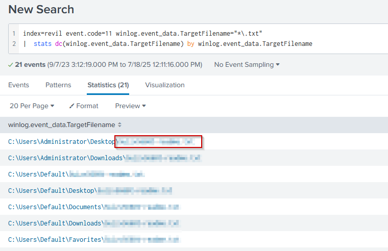
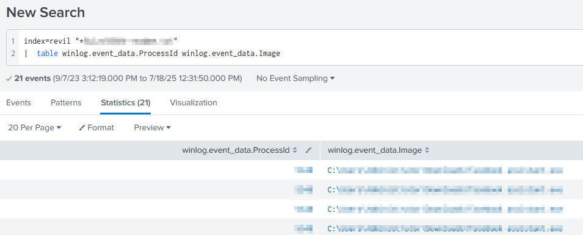
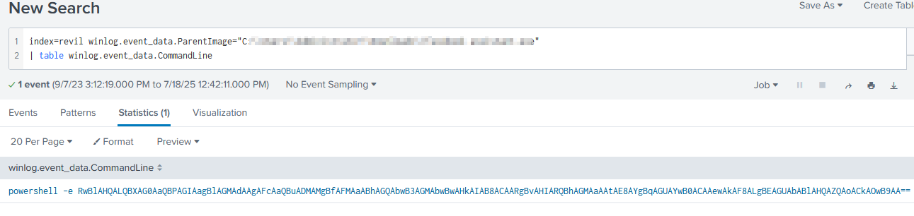
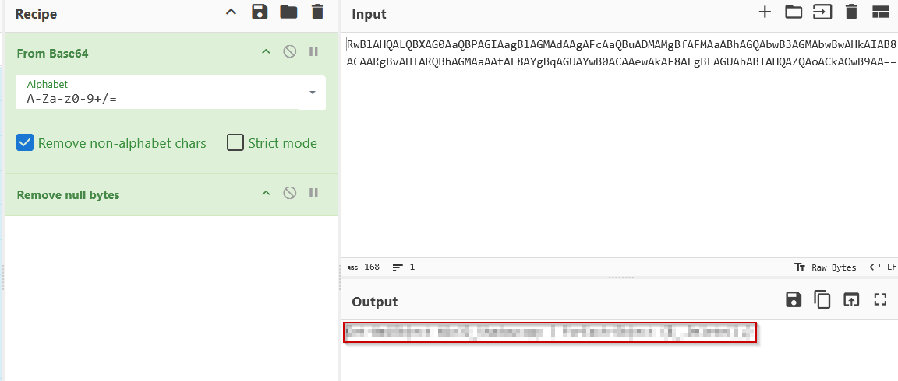
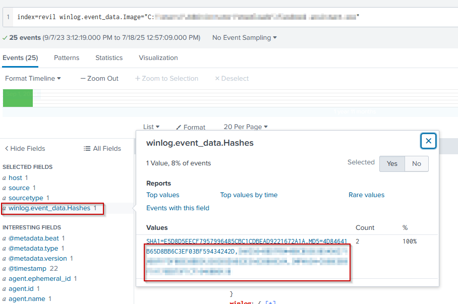
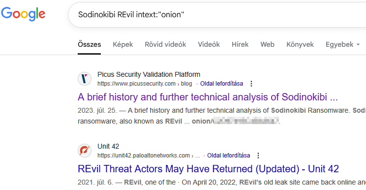
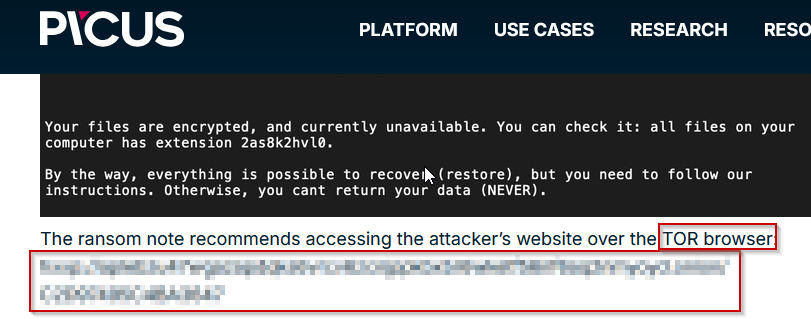

# Investigating Ransomware Attack With Splunk
*A professional writeup for a malware analysis case (CyberDefenders - REvil Lab)*

**Tags:** `#threat-hunting` `#splunk` `cyberchef` `log-analysis` `google-dorking` `siem`

## Case Summary

- **Type:** Threat Hunting
- **Source / Platform:** CyberDefenders
- **Scenario:** You are a Threat Hunter working for a cybersecurity consulting firm. One of your clients has been recently affected by a ransomware attack that caused the encryption of multiple of their employees' machines. The affected users have reported encountering a ransom note on their desktop and a changed desktop background. You are tasked with using Splunk SIEM containing Sysmon event logs of one of the encrypted machines to extract as much information as possible.
- **Date Completed:** 2025-07-18
- **Objective:** Extract as much information as possible based on the provided logs.

---

## Tools Used
- `Splunk`, `CyberChef`, '`Google Dorks`'
---

## Q1. To begin your investigation, can you identify the filename of the note that the ransomware left behind?

### Methodology
1. First I looked up some Sysmon documentation on Google to find common Event IDs, especially the one related to file creation.
2. Then, using SPL I queried all the logged events that had that specific EventID field, along with txt filetype. It seems that the ransomware placed the same text file at multiple common locations, possibly for users to find it quickly. The below image shows the full query.
   
   *Figure 1: Querying the text note the ransomware left behind, using SPL in Splunk*

## Q2. After identifying the ransom note, the next step is to pinpoint the source. What's the process ID of the ransomware that's likely involved

### Methodology
1. Okay, so knowing the note filename, I searched for events that contained the string as a postfix, and then looked for their Process ID and Image fields. 
   
   *Figure 2: The query that results in some process information about the probable ransomware*

## Q3. Having determined the ransomware's process ID, the next logical step is to locate its origin. Where can we find the ransomware's executable file?

### Methodology
1. Accidentally solved with the previous task.

## Q4. Now that you've pinpointed the ransomware's executable location, let's dig deeper. It's a common tactic for ransomware to disrupt system recovery methods. Can you identify the command that was used for this purpose?
### Methodology
1. I figured that maybe I should search for events related to the child processes of the ransomware, as the question hints at the tactic using a command that was run. 
   
   *Figure 3: The query that finds all command runs of the child processes of the ransomware*
2. Then I used CyberChef to decode and deobfuscate the powershell payload.
   *Figure 4: Deobfuscating the previously found PowerShell payload using CyberChef*
## Q5. As we trace the ransomware's steps, a deeper verification is needed. Can you provide the sha256 hash of the ransomware's executable to cross-check with known malicious signatures?

### Methodology
1. I just searched again for the ransomware as the winlog.event_data.Image and then added the "winlog.event_data.Hashes" field to the selected fields.
   
   *Figure 5: Sysmon logged hashes of the ransomware as seen in Splunk*

## Q6. One crucial piece remains: identifying the attacker's communication channel. Can you leverage threat intelligence and known Indicators of Compromise (IoCs) to pinpoint the ransomware author's onion domain?

### Methodology
1. I did a Google search for the hash. Clicked on the MalwareBazaar search result. 
2. The signature and tags contained "Sodinokibi". So I searched for that on Google. According to Wikipedia this is also known as "REvil".
3. Did a final bit of Google Dorking which has lead me to a [Picus security article](https://www.picussecurity.com/resource/blog/a-brief-history-and-further-technical-analysis-of-sodinokibi-ransomware) about the ransomware.
   
   *Figure 6: The Google Dorking search for an article that contains the onion address*
4. Upon reading the article, the full (defanged) onion address reveals itself.
   

--- 
## Final Outcome

A user has downloaded the ransomware disguised as a social media "helper" program. When the ransomware detonated, all files were encrypted and the ransom note text files were dropped to common locations. The ransomware could be attributed to a Russia-based or at least Russian-speaking RaaS operation. The attacker's communication channel was successfully identified as well. Its important to note that the attacker's identity is not necessarily the same as the identity of the malware writer, precisely because of how RaaS as a business model works.

---

## Lessons Learned
- How Sysmon stores process information.
- What is RaaS, REvil and Sodinokibi
- What PowerShell command can be used to delete Windows Shadow Copy snapshots to disrupt system recovery.

---

## References & Resources
- [CyberDefenders - GetPDF Lab](https://cyberdefenders.org/blueteam-ctf-challenges/getpdf/)
- [Sysmon common Event IDs](https://learn.microsoft.com/en-us/sysinternals/downloads/sysmon)
- [Picus security ransomware article](https://www.picussecurity.com/resource/blog/a-brief-history-and-further-technical-analysis-of-sodinokibi-ransomware)
- [IBM: What is RaaS?](https://www.ibm.com/think/topics/ransomware-as-a-service)
- [Google Dorking Cheatsheet](https://gist.github.com/sundowndev/283efaddbcf896ab405488330d1bbc06)
