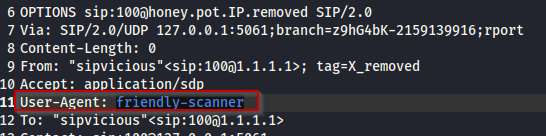

# VoIP Network Forensics writeup
*A professional writeup for a network forensics lab involving VoIP technology (Cyberdefenders - Acoustic)*

**Tags:** `#DFIR` `#NetworkForensics` `#Wireshark` `#VoIP` `#shell` `#bash`

## Case Summary

- **Type:** Network Forensics
- **Source / Platform:** Cyberdefenders
- **Scenario:** This lab takes you into the world of voice communications on the internet. VoIP is becoming the de-facto standard for voice communication. As this technology becomes more common, malicious parties have more opportunities and stronger motives to control these systems to conduct nefarious activities. This challenge was designed to examine and explore some of the attributes of the SIP and RTP protocols.
 
  Lab Files:

- "_log.txt_" was generated from an unadvertised, passive honeypot located on the internet such that any traffic destined to it must be nefarious. Unknown parties scanned the honeypot with a range of tools, and this activity is represented in the log file.
    - The IP address of the honeypot has been changed to "honey.pot.IP.removed". In terms of geolocation, pick your favorite city.
    - The MD5 hash in the authorization digest is replaced with "MD5_hash_removedXXXXXXXXXXXXXXXX"
    - Some octets of external IP addresses have been replaced with an "X"
    -  Several trailing digits of phone numbers have been replaced with an "X"
    -  Assume the timestamps in the log files are UTC.
- "_Voip-trace.pcap_" was created by honeynet members for this forensic challenge to allow participants to employ network analysis skills in the VOIP context.
- **Date Completed:** 2025-08-17
- **Objective:** As a soc analyst, analyze the artifacts and answer the questions.

---

## Tools Used
- `Wireshark` `Google` `bash` `cut` `grep`
---

## Q1. What is the transport protocol being used?

### Methodology

1. I investigated the start of the VoIP traffic by opening the provided PCAP file with Wireshark. The transport layer protocol is clearly visible.
   
   *Figure 1: VoIP (SIP + RTP) traffic as seen in Wireshark.*

## Q2. The attacker used a bunch of scanning tools that belong to the same suite. Provide the name of the suite.

### Methodology

1.  First I searched through HTTP traffic, as I thought the user had done some directory enumeration. I looked at the User-Agent field more specifically, because it often contains clues for the enumeration or scanning tool the attacker uses. No luck there.
2. Looked at the other provided log.txt file, which clearly had a more interesting User-Agent. Then I did a Google search for the suite based on the found tool.
   
   *Figure 2: Scanner tool name present in the log file.*

## Q3. What is the User-Agent of the victim system?

### Methodology

1. First I used `cat log.txt | grep "User-Agent" | grep -v "friendly-scanner"`  to filter out what other User-Agents are present. There is one, but that is not the answer.
2. I then jumped back to the PCAP analysis in Wireshark and filtered for SIP protocol. Looked through the Message Header of a message that was a reply from the victim system.
   
   *Figure 3: User-Agent of the victim system as seen in Wireshark*

## Q4. Which tool was only used against the following extensions: 100,101,102,103, and 111?

### Methodology

1. Looked through Wireshark, nothing interesting. Switched to log.txt and then started searching for the extension numbers. At first, found nothing interesting. So I went to the suite vendor's site which I previously visited and looked at the other tools. One stood out as interesting.
   
   *Figure 4: One of the tools stands out regarding extensions on the [suite vendor's site](https://www.enablesecurity.com/sipvicious/)*
2. Started searching for the name of the tool in the PCAP and log.txt file too, with no luck. Then I inspected the traffic logged in the log.txt file which were related to the extensions given in the question. Found authorization attempts at multiple mentioned extensions. This further confirmed my suspicion of the tool, and it turned out to be right.
   
   *Figure 5: Authorization attempt as it appears for the extension 111 in the log.txt file. *

## Q5. Which extension on the honeypot does NOT require authentication?

### Methodology

1. Used a simple bash pipeline to get the extensions which do have an authorization header present. The one which does not appear is the solution.
   
   *Figure 6: Filter for extensions that do have authorization headers in the log.txt file*

## Q6. How many extensions were scanned in total?

### Methodology

1. This gave me quite a headache, but eventually I solved it. The trick was that there were lines which only contained "REGISTER sip\:honey.pot.IP.removed" and other line continuations, which were counted in as well in my previous attempts. The command which gives the right answer:
   
   *Figure 7: The total number of extensions scanned in total.*

## Q7. There is a trace for a real SIP client. What is the corresponding user-agent? (two words, once space in between)

### Methodology

1. Already found this previously. Used the following command:
   
   *Figure 8: The User-Agent for the real SIP client extracted from log.txt*

## Q8. Multiple real-world phone numbers were dialed. What was the most recent 11-digit number dialed from extension 101?

### Methodology

1. This can be found by inspecting the "INVITE" messages in log.txt which originate from the extension 101. Used a bash pipeline again:
   
   *Figure 9: The last real-world phone number dialed from extension 101*
   
## Q9. What are the default credentials used in the attempted basic authentication? (format is username:password)

### Methodology

1. I changed the Wireshark filter to include http traffic, as previously I had seen Authorization headers with credential information in them.
   
   *FIgure 10: The default credentials used in the attempted basic authentication*

## Q10. Which codec does the RTP stream use? (3 words, 2 spaces in between)

### Methodology

1. I changed the Wireshark filter again, this time to match only rtp traffic. The answer can be found by inspecting the Real-Time Transport Protocol fields of basically any of the filtered packets.
   
   *Figure 11: The codec which the RTP stream uses, as seen in Wireshark*

## Q11. How long is the sampling time (in milliseconds)?

### Methodology

1.  Searched for the codec on Google. The wikipedia page clearly states the sampling frequency. From there you can do the math: \(1/frequency\)\*1000 gives the result in milliseconds.
   
   *Figure 12: The sampling frequency of the codec according to Wikipedia*

## Q12. What was the password for the account with username 555?

### Methodology

1. Exported HTTP objects using Wireshark. One of the files was suspicious, because it seemed to fetch SIP configuration through a php script. I exported that response, and looked through it to find the configuration fields.
   
   *Figure 13: The credentials for the account with username 555 in the exported HTTP object*

## Q13. Which RTP packet header field can be used to reorder out of sync RTP packets in the correct sequence?

### Methodology

1. Looking through the RTP headers the answer can be easily seen. At first I thought its the sequence number (and I still think that should be used, as it is commonly used for this purpose), but apparently the answer is another field.

## Q14. The trace includes a secret hidden message. Can you hear it?

### Methodology

1.  Used Wireshark's (quite awesome) RTP playback function. It can be found under the "Telephony" menu and "VoIP calls" submenu option. When the secret phrase is said, the audio drops a bit, so you have to piece it together from the 2 pieces of audible information before and after the drop.
 
---

## Final Outcome

The artifacts were successfully analyzed.

---

## Lessons Learned

- How SIP works
- What is RTP and how its used
- Wireshark's RTP playback functionality
- What attacking tools are available to use in VoIP.

---

## References & Resources
- https://cyberdefenders.org/blueteam-ctf-challenges/acoustic/
- https://www.enablesecurity.com/sipvicious/
- https://en.wikipedia.org/wiki/G.711
- https://en.wikipedia.org/wiki/Real-time_Transport_Protocol
- https://en.wikipedia.org/wiki/Session_Initiation_Protocol