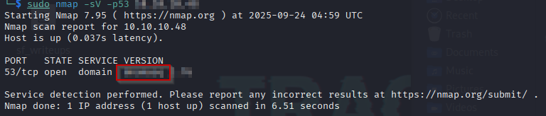
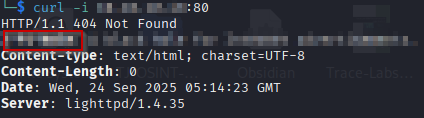
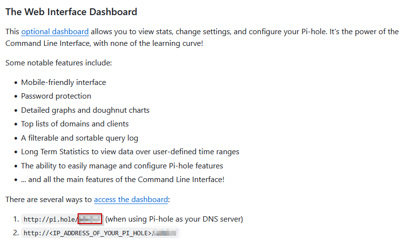
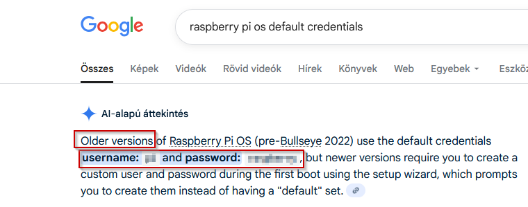
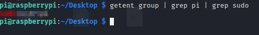
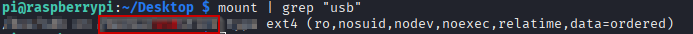

*A professional writeup for an ethical hacking case (HTB - Mirai Lab)*

**Tags:** `#hacking` `#forensics` `#nmap` `#curl` `#http` `#dns` `#raspberrypi` `#linux`

## Case Summary

- **Type:** Forensics
- **Source / Platform:** HTB
- **Scenario:** Mirai demonstrates one of the fastest-growing attack vectors in modern times; improperly configured IoT devices. This attack vector is constantly on the rise as more and more IoT devices are being created and deployed around the globe, and is actively being exploited by a wide variety of botnets. Internal IoT devices are also being used for long-term persistence by malicious actors.
- **Date Completed:** 2025-09-24
- **Objective:** Hack into machine, get user flag, get root flag.

---

## Tools Used
- `Google`, `nmap`, `curl`, `strings`, `BurpSuite`
---

## Q1. What is the name of the service running on TCP port 53 on Mirai? Don't include a version number.

### Methodology
1.  Did a simple nmap scan for port 53 on the machine IP.

   

   *Figure 1: The DNS service running on port 53 as seen from the output of the nmap scan*

## Q2. What unusual HTTP header is included in the response when visiting the service on port 80?

### Methodology
1.  Used curl with option "-i" to include the response headers in the output.

   

   *Figure 2: The strange HTTP header included in the response to the curl command*

## Q3. What relative path on the webserver presents the Pi-hole dashboard?

### Methodology
1.  Did a Google search for the found header. Turns out this is an ad-blocker service. Searches returned the GitHub page of the software ([Pi-hole GitHub](https://github.com/pi-hole/pi-hole)), which had the answer about the web interface path.

   

   *Figure 3: The web interface dashboard path as seen on the GitHub page of Pi-hole*

## Q4. What was the default username on a Raspberry Pi device?

### Methodology
1.  I knew that Raspberry Pi devices have Raspberry Pi OS by default, so I googled for the credentials. Google responded with its AI by default, and that turned out to be the answer for both Q4 and Q5.

   

   *Figure 4: The default credentials of older Raspberry Pi OS versions, meant for Raspberry PI devices.*

## Q5. What is the default password for the pi user?
### Methodology
1.  See the answer for Q4.

## Q6. Submit the flag located on the pi user's desktop.
### Methodology
1.  At first I tried bruteforcing the pi-hole admin console password with BurpSuite. That didn't seem to go anywhere.
2.  Then I tried to look up CVEs for the DNS service the machine is running. Dead end too.
3.  Finally, I gave into temptation and looked at one of the walkthroughs. Turns out I should have scanned more ports with nmap, as SSH is enabled on the machine. I immediately tried with the default user and the password and I was in. From there the user flag is accessible.

## Q7. Can the pi user run any command as root on Mirai?
### Methodology
1.  I looked at whether the user is added to the sudo group.

   

   *Figure 5: Check whether the pi user is part of the sudo group.*

## Q8. The flag-less `root.txt` file mentions that it's on the USB stick. What is the mountpoint for a device that is labeled as a USB stick on this host?
### Methodology
1.  Used the mount command to find any mountpoints that had the string "usb" in their names.

   

   *Figure 6: Find the mountpoint which has "usb" string in its label.*

## Q9. What is the full path to the device that represents the raw USB media on Mirai?
### Methodology
1.  The previous command already gave away the answer for this question.

## Q10. When files are deleted from a drive, is the memory definitely immediately overwritten with something else?
### Methodology
1.  I knew this from before. The OS marks that file in memory as "overwritable".

## Q11. Submit the flag located on the USB device.
### Methodology
1.  The previous answer gave clues to the solution, but honestly I thought I had to use an external recovery tool for this. So I used a hint. After reading it, the harsh truth of "In Linux everything is a file" immediately occurred to me. From there I used `strings` to read the flag out of the full path of the device.

---

## Lessons Learned

1. Sometimes the running services have only very subtle clues about how to get into a HTB machine. Here, only the "Raspberry Pi" element to Pi-hole service was relevant.
2. Its better to do a quick scan for all the common ports with nmap first, not just a targeted one. That way the attack surface potentially grows.
3. In Linux, you can read the contents of even deletes files on whole devices, since the devices are represented as files too. Very useful knowledge for forensics. 

---

## References & Resources
- [HTB - Mirai lab](https://app.hackthebox.com/machines/Mirai)
- [Pi-hole GitHub](https://github.com/pi-hole/pi-hole)
- [dnsmasq wiki](https://en.wikipedia.org/wiki/Dnsmasq)
- [CVE-2017-14491](https://nvd.nist.gov/vuln/detail/cve-2017-14491)
